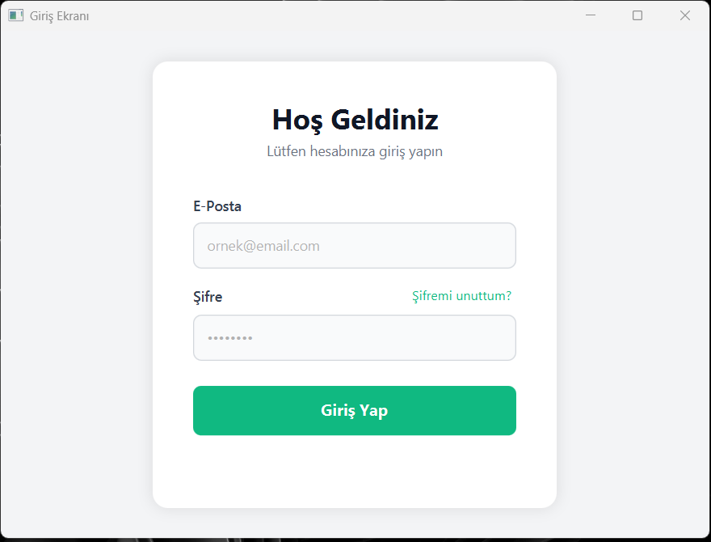
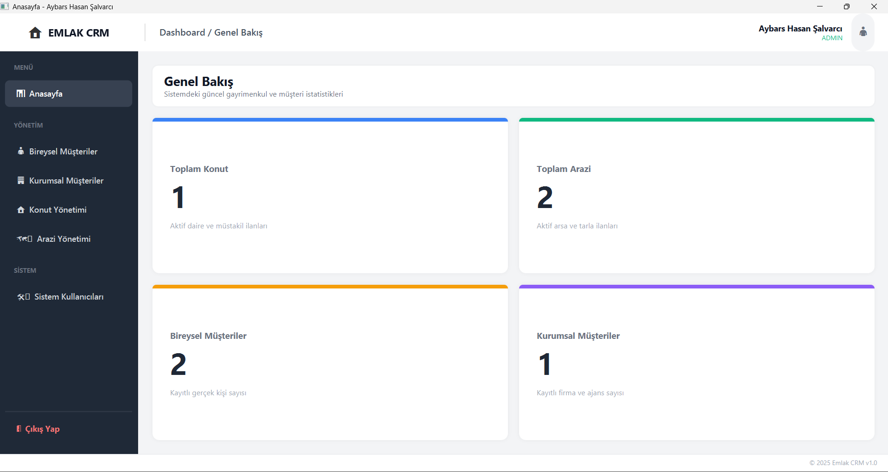
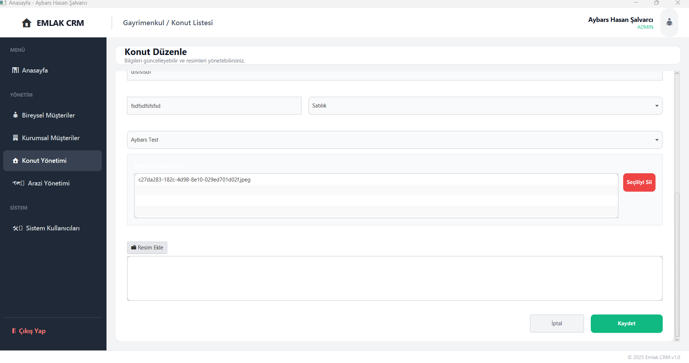

# 🏠 Emlak CRM - Gayrimenkul Yönetim Sistemi

Emlak CRM, gayrimenkul danışmanları ve emlak ofisleri için geliştirilmiş, portföy ve müşteri yönetimini kolaylaştıran modern bir masaüstü uygulamasıdır. JavaFX kullanılarak geliştirilen bu proje, kullanıcı dostu arayüzü ve verimli veri yapıları kullanımıyla öne çıkmaktadır.

## ✨ Öne Çıkan Özellikler

* **📊 Dashboard:** Genel istatistiklerin ve sistem durumunun izlenebildiği ana panel.
* **🏢 Portföy Yönetimi:** 
  * **Konut:** Detaylı özellikler, lokasyon bilgileri ve çoklu resim desteği ile konut yönetimi.
  * **Arazi/Arsa:** İmar durumu, ada/parsel bilgileri ve lokasyon detayları ile arazi yönetimi.
* **👤 Müşteri Yönetimi:** Bireysel ve kurumsal müşteri kayıtları, onay süreçleri ve iletişim bilgileri.
* **🛠️ Sistem Yönetimi:** Admin yetkilendirmesi ile sistem kullanıcılarının yönetimi.
* **🔐 Güvenlik:** Şifreleme, doğrulama kodları (OTP) ve "Şifremi Unuttum" akışlarını içeren güvenli kimlik doğrulama sistemi.
* **🖼️ Resim Galeri Desteği:** Gayrimenkullere çoklu resim ekleme, görüntüleme ve silme özellikleri.

## 🛠️ Kullanılan Teknolojiler ve Mimari

* **Dil:** Java 21
* **Arayüz:** JavaFX (FXML)
* **Veri Yapıları:** Verilerin hızlı işlenmesi ve hiyerarşik yönetimi için **Binary Search Tree (BST)** yapısı kullanılmıştır.
* **Tasarım:** Modern UI/UX Prensipleri, CSS tabanlı özelleştirmeler.
* **Araçlar:** Scene Builder, Maven.


## 🚀 Kurulum ve Çalıştırma

1.  **Projeyi Klonlayın:**
    ```bash
    git clone [https://github.com/aybarsalvarci/veriYapilariProjesi](https://github.com/aybarsalvarci/veriYapilariProjesi)
    ```
2.  **Bağımlılıkları Yükleyin:** Proje Maven yapısındadır. Kullandığınız IDE üzerinden Maven bağımlılıklarını yükleyin.
3.  **Çalıştırın:** `src/main/java/com/ds/Main.java` dosyasını çalıştırarak uygulamayı başlatın.

## 📸 Ekran Görüntüleri

| Giriş Ekranı | Dashboard | Konut Düzenleme |
|:---:|:---:|:---:|
|  |  |  |

## 👥 İletişim

E-posta: [aybarsalvarci44@gmail.com](mailto:aybarsalvarci44@gmail.com)</br>
LinkedIn: [Aybars Hasan Şalvarcı](https://www.linkedin.com/in/aybars-hasan-%C5%9Falvarc%C4%B1-46b553202/)